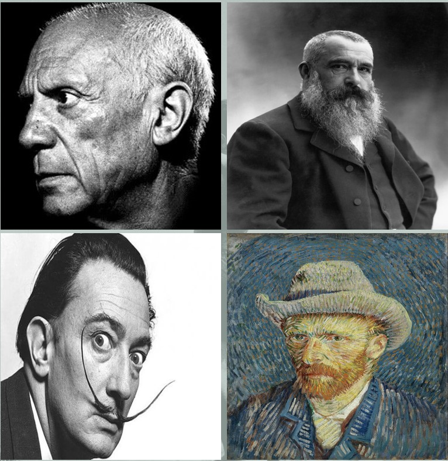
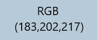
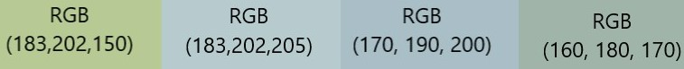
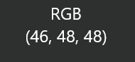
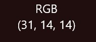
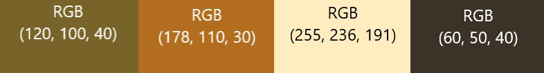
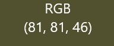
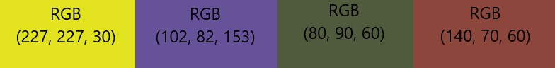

```{r setup, include=FALSE}
knitr::opts_chunk$set(echo = TRUE)
knitr::opts_chunk$set(warning = FALSE, message = FALSE)
```
\newpage
\begin{centering}
\begin{center} \Large \textbf{Acknowledgement}\end{center}
We group-3 would like to express our profound gratitude towards \textbf{Dr. Dootika Vats}, our
academic and project instructor for MTH208A(Data Science Lab), for her
guidance and constant supervision throughout the process and providing creative ideas and necessary 
information regarding the project which led to the completion of this project.
It has been a great learning experience and this project has
provided us with a practical insight of the theoretical knowledge
gathered during the course lecture.

\end{centering}

\newpage
\begin{center} \Large \textbf{Introduction}\end{center}

Colors are everywhere around us. And while the first thing we notice in a painting is its color, we do not realize that there is a lot more we are taking in. Color communicates so much. It has the power to convey moods and feelings like when people say, *"He was green with envy"*, *"I am feeling blue"* or *"She was red hot"*. It is for this reason that choosing colors and choosing where they fit in our lives is essential to how we live and the kind of lives we try to cultivate.
\newline Now talking about paintings, *"Painting"* is a form of artistic expression that has been known to be practiced by mankind since the dawn of civilization. The world has seen some phenomenal painters and artists,some of the famous painters of the world who made their contribution to art include Leonardo da Vinci, Raphael, Claude Monet, Frida Kahlo, Salvador Dali, Vincent Van Gogh, Pablo Picasso, Michelangelo, Rembrandt to name a few. While the true definition of painting is subject to interpretation, in the end, it is the epitome of an artist's emotions and creativity translated into a pattern of strokes and colors.
\newline
As beautifully quoted by someone ***" Painting is the magical conjunction of space and no space, movement in stillness. It is a form of expressing emotions, depicting things we observe."***
\newline
In works of art, artists use color to depict and describe the subject. Artists, especially painters, utilize their knowledge of color to portray mood, light, depth, and point of view in a work of art. Different painters used to follow different styles in their paintings. Some painters used to have less color variations, whereas some of them loved to use various colors within their paintings, which we tried to analyse here in this project. Our motive is to visualize different color palettes and color variations in various paintings of some world famous painters. By analyzing this, can we try to interpret what a 
painter is trying to depict to some extent.
\newline
For this study we have considered four painters namely Pablo Picasso, Claude 
Monet, Salvador Dali and Vincent Van Gogh.
\newline\newline
```{r echo = FALSE, out.width="110%",out.height="50%", fig.align='center'}
 
```


\newpage
## Description of the Data:
* \textbf{Preliminary Data:} To analyse the color variations in paintings of different painters, paintings from different years were collected as potential data set. Corresponding to each painter, that is, Pablo Picasso, Claude Monet, Vincent Van Gogh and Salvador Dali, mainly name of the paintings, years they were made in and their 	corresponding links were scrapped from <https://www.wikiart.org/> and <https://commons.wikimedia.org/wiki/Main_Page>. 

* \textbf{Obtaining the Preliminary Data:} All the information mentioned in the preliminary data were extracted from the mentioned websites via **web scrapping** through library *rvest* in R studio.


* \textbf{Obtaining the Final Data:} Corresponding to each painter a data frame consisting of name of the paintings, year in which they were made and the painting links are obtained. After that, to get relevant quantitative observations corresponding to each painting of the painters, *imager* library in R studio is used. First to check whether we can load and work with the images, *for loop* had been used to load the painting links by the function *load.image()* corresponding to all the painters. For some links, error occurred in loading the image because of incorrect standard format of dimensions of image and some of the images were not in *.jpg*, *.jpeg* or in *.png* format. In that cases we noted down the index of the painting in that data frame. Along with these indices we also noted down the indices of the images with size more than 5 mb and the paintings for which the year in which it was made was not available. After checking for all the paintings of a particular painter, we removed those rows from the data set having the mentioned indices. Next we found that the data set corresponding to Claude Monet had 714 rows, but the data sets corresponding to other painters had more than 714 rows in it. So, for better compatibility we considered 714 rows from each of the four data frames.\newline
Then corresponding to each painter, medians and quartile deviations of the pixel values for three color channels red, green and blue was computed for all the paintings. Moreover, the color proportion corresponding to sixteen basic colors have been computed for each of the painting. Also by averaging the color proportion of 38 dark shades we made a variable denoting average dark shade in a particular painting. Similarly by averaging color proportions of 47 medium shades and 53 light shades we obtain two another variable denoting the average medium dark shade and average light dark shade used in a particular painting for a given painter.\newline\newline
Then finally we combined all the four data frames in a single data frame which we considered as our final data, named ***final_data_grp3***, based on which we have worked in this project.


* \textbf{Relevant Features of the Data:}
  - There are 714 data points for each painters.
  - To compute the color proportion of a particular color in a painting, we have considered the proportion of pixels with which the given color has distance less that 0.5 unit (threshold value).
  - The sixteen basic color and all the colors with which dark, medium and light shade are constructed are taken from the link: <https://www.rapidtables.com/web/color/RGB_Color.html>
  - The final data frame namely ***final_data_grp3***, has 2856 rows and 29 columns.
\newline

### A Glimpse of the Data set (Showing the first 6 rows):
```{r echo=FALSE}
load("Final_DATA_GRP3.Rdata")
head(final_data_grp3)
```

## Possible Biases in the Data:

* The websites from where we have collected the data contains almost all the paintings of each of the painters. But all the paintings uploaded in the websites are clicked photographs. So, the original color shades used in the paintings may appear different to some extent in the photographs which will lead to biases in the data.

* The threshold we used to calculate different color proportions in a painting is subjective in nature. So, there is a possibility that some other threshold value will give more accurate data. Also for different color shades different thresholds may be appropriate. Hence for the choice of threshold value as $0.5$ biases may arise.

* Here we considered limited number of color shades to compute different color proportions. So, for example there is a possibility that the yellow shade Van Gogh used is not close to the pure yellow shade we considered with RGB values (0,1,1). This will result bias in the data to some extent.

* The data includes some pencil sketches of the painters which will result high proportion of white and black colors in those paintings. But actually no color have used there. As a result this will lead to some biases in the data.

\newpage
## Interesting Questions to be Asked from the Data:
1. For a given painting can we produce a graph that tells the possible colors used in that painting, so that looking at the graph only, can we predict the possible colors used in the corresponding painting?

2. Can the extent of color variations for a given painting be measured?

3. In given painting what is the approximate color proportion of a particular color?

4. Whether on an average there were any differences in color variations in a painting with respect to different painters?

5. Whether there are any painter who on an average used to use multiple colors in his paintings and whether there are any painter who on an average used to use flat colors throughout the painting?

6. How the use of different colors had changed over the respective careers of the painters?

7. Given a painting, can it be determined that which painter it belongs to?
\newline

## Important Visualizations:
To analyze the color variation of individual paintings of each painter, density plots and box plots of three color channels red, green and blue have been plotted. Also the bubble plot of different color proportions have been plotted. Some insights of these plots are given below corresponding to each painter.
\newline 

**Note :** Each pixel of an image consists of values corresponding to three color channels red, green and blue. Each color channel can take values from 0 to 255. In R studio, the values of color channels are represented by a proper fraction. That is, if $0 \leq x \leq 255$ be the pixel value corresponding to red color channel then the value in R studio will be $a/255$.\newline
**Pixel :** A pixel is the smallest unit of a digital image or graphic that can be displayed and represented on a digital display device.

\newpage
## Claude Monet
Let us consider the painting given below, drawn in 1871.
\newline

```{r monetplot, echo=FALSE, fig.height=4, fig.width=6, fig.align='center'}
library(imager)
load("Final_DATA_GRP3.Rdata")
attach(final_data_grp3)
plot(load.image(Links[64]), main = paste(Painting_Names[64]),)
```

```{r monetdenisty, echo=FALSE, fig.height=5,fig.width=10, fig.align='center'}
library(imager)
load("Final_DATA_GRP3.Rdata")

col.mat <- as.array((load.image(final_data_grp3$Links[64]))[,,1,])
    
    plot(density(col.mat[,,1]), main = "Density Plot of Pixel Values of Three Color Channels Red, Green and Blue",
         xlab = "Intensity (Pixel Values of the Colour Channels)", ylab = "Density",col = 2,type = "l" ,lwd = 2, cex.lab = 1.2, cex.axis = 1.2,
         ylim = c(0,max(density(col.mat[,,1])$y) + 4),
         xlim = c(-0.05,1.05))
    lines(density(col.mat[,,2]),
          col = 3, lwd = 2)
    lines(density(col.mat[,,3]),
          col = 4, lwd = 2)
```
\newpage
### Observations:
From the density plot of three color channels it is observed that the red, green and blue color channels attain its peaks at around 0.71, 0.79 and 0.85. This means on an average in most of the pixels of the image have RGB value as ***(0.71, 0.79, 0.85)***, which when multiplied by 255 gives the value of the triplet as ***(183, 202, 217)*** whose corresponding color shade is given below,
\newline

{width=10%,height=10%}
\newline
This above color is dominant in the painting.
```{r monetboxplot, echo=FALSE, fig.height=4,fig.width=10, fig.align='center'}
   library(imager)
   library(ggplot2)
   load("Final_DATA_GRP3.Rdata")

    col.mat <- as.array((load.image(final_data_grp3$Links[64]))[,,1,]) 

    pixels = c(as.vector(col.mat[,,1]) , as.vector(col.mat[,,2]) , as.vector(col.mat[,,3]))
    
    category = c(rep("Red",length(as.vector(col.mat[,,1]))) , rep("Green",length(as.vector(col.mat[,,2]))) ,                  rep("Blue",length(as.vector(col.mat[,,3]))))
    
    p_c_data = data.frame(Category = category , Pixels = pixels )
    
    ggplot(p_c_data, aes(x = Category, y = Pixels, fill = category)) +
      geom_boxplot(width = 0.35,alpha = 0.4, show.legend = F, outlier.colour = "black",
                   outlier.fill="white") +
      scale_color_manual(values = c("blue","green","red"))+
      scale_fill_manual(values = c("blue","green","red"))+
      labs(y = "RGB Values", x = "", title = "Boxplot showing the Variation in the Pixel Values of Three Color Channels Red, Green and Blue")+
      theme(axis.title.x = element_text(face = 'italic'), axis.text.x = element_text(size = 15))+
      theme(axis.title.y = element_text(face = 'italic', angle = 90),axis.title.y.left = element_text(size =15),
            axis.text.y = element_text(size = 15), plot.title = element_text(size = 15))
    
```

### Observations:
From the box plots of three different color channels it is observed that box plot of blue is wider than that of red and green color channels. So the values corresponding to blue color channel is more dispersed than that of red and green. We can roughly say, the pixel values corresponding to red color channel is varying between 0.60 (equivalent to 186) to 0.72 (equivalent to 186). Similarly the range for green is in between 0.65 to 0.8 (equivalent to 168 to 206) and blue is in between 0.56 to 0.83 (equivalent to 145 to 212). Most of the pixels will take values covered by the Inter Quartile Range that is the width of the box plots. Now, some different RGB color values within the intervals mentioned above with respect to the given painting are given by,
\newline

\newline
Here all these shades are dominant in the painting we considered.
\newline

```{r monetcolplot, echo=FALSE, fig.height=4,fig.width=10, fig.align='center'}
    load("Final_DATA_GRP3.Rdata")
    load("col_hex.Rdata")
    load("color_names.Rdata")
    
    dat <- final_data_grp3[which(final_data_grp3$Painting_Names == "Bords de la Seine a Argenteuil - Monet"),]
    library(ggplot2)
    props <- array(0)
    hex_code <- array(0)
    for(i in 1:length(c("Gray","Olive","Silver","White"))){
      props[i] <- dat[1,which(colnames(dat) == (c("Gray","Olive","Silver","White"))[i])]
      hex_code[i] <- col.hex[which(col.names == (c("Gray","Olive","Silver","White"))[i])]
    }
    df.temp <- data.frame(c("Gray","Olive","Silver","White"),props,hex_code)
    colnames(df.temp) <- c("multicol","proportions","hex")
    df.temp = df.temp[order(df.temp$multicol),]
    
    ggplot(df.temp, aes(x = multicol, y = proportions, size = (2*proportions)))+
      geom_point(aes(color = multicol))+
      labs(x = "", y = "Values of Color Proportions", color = "Colors", subtitle  = "Size of each point corresponds to twice of the color proportions", title = "Color Proportions of Different Colors")+
      scale_color_manual(values = df.temp$hex)+
      theme(axis.title.y = element_text(size = 15), axis.text.y = element_text(size = 10),
            axis.text.x = element_text(size = 15), legend.title = element_text(size = 15),
            legend.text = element_text(size = 14), plot.subtitle = element_text(size = 10),
            plot.title = element_text(size = 20))+
      ylim(0,1)
    
```

This is bubble plot of different color proportions where size of each of the bubble is $(2*proportion)$.

### Observations:
From the above plot it is clearly seen that the color proportions corresponding to Gray, Silver and White are high, which is also visible in the original painting.

\newpage
## Pablo Picasso
Let us consider the painting given below, drawn in 1903.

```{r picassoplot, echo=FALSE, fig.height=5, fig.width=5, fig.align='center'}
library(imager)
load("Final_DATA_GRP3.Rdata")
attach(final_data_grp3)
plot(load.image(Links[880]), main = paste(Painting_Names[880]),)
```

```{r picassodenisty, echo=FALSE, fig.height=5,fig.width=10, fig.align='center'}
library(imager)
load("Final_DATA_GRP3.Rdata")

col.mat <- as.array((load.image(final_data_grp3$Links[880]))[,,1,])
    
    plot(density(col.mat[,,1]), main = "Density Plot of Pixel Values of Three Color Channels Red, Green and Blue",
         xlab = "Intensity (Pixel Values of the Colour Channels)", ylab = "Density",col = 2,type = "l" ,lwd = 2, cex.lab = 1.2, cex.axis = 1.2,
         ylim = c(0,max(density(col.mat[,,1])$y) + 4),
         xlim = c(-0.05,1.05))
    lines(density(col.mat[,,2]),
          col = 3, lwd = 2)
    lines(density(col.mat[,,3]),
          col = 4, lwd = 2)
```

### Observations:
From the density plot of three color channels it is observed that the red, green and blue color channels attain its peaks at around 0.71, 0.79 and 0.85. This means on an average in most of the pixels of the image have RGB value as ***(0.18, 0.19, 0.19)***, which when multiplied by 255 gives the value of the triplet as ***(46, 48, 48)*** whose corresponding color shade is given below,
\newline
{width=10%,height=10%, out.width=20%,}
\newline
This above color is dominant in the painting.
```{r picassoboxplot, echo=FALSE, fig.height=4,fig.width=10, fig.align='center'}
   library(imager)
   library(ggplot2)
   load("Final_DATA_GRP3.Rdata")

    col.mat <- as.array((load.image(final_data_grp3$Links[880]))[,,1,]) 

    pixels = c(as.vector(col.mat[,,1]) , as.vector(col.mat[,,2]) , as.vector(col.mat[,,3]))
    
    category = c(rep("Red",length(as.vector(col.mat[,,1]))) , rep("Green",length(as.vector(col.mat[,,2]))) ,                  rep("Blue",length(as.vector(col.mat[,,3]))))
    
    p_c_data = data.frame(Category = category , Pixels = pixels )
    
    ggplot(p_c_data, aes(x = Category, y = Pixels, fill = category)) +
      geom_boxplot(width = 0.35,alpha = 0.4, show.legend = F, outlier.colour = "black",
                   outlier.fill="white") +
      scale_color_manual(values = c("blue","green","red"))+
      scale_fill_manual(values = c("blue","green","red"))+
      labs(y = "RGB Values", x = "", title = "Boxplot showing the Variation in the Pixel Values of Three Color Channels Red, Green and Blue")+
      theme(axis.title.x = element_text(face = 'italic'), axis.text.x = element_text(size = 15))+
      theme(axis.title.y = element_text(face = 'italic', angle = 90),axis.title.y.left = element_text(size =15),
            axis.text.y = element_text(size = 15), plot.title = element_text(size = 15))
    
```


### Observations:
From the box plots of three different color channels it is observed that box plot of blue, red and green color channels have almost same height also the median lines(horizontal black lines in the box plot) are almost co-linear. This indicates the image does not have to much variety of shades of different colors. We can roughly say, the pixel values corresponding to red color channel is varying between 0.15 (equivalent to 38) to 0.35 (equivalent to 89). Similarly the range for green is in between 0.17 to 0.38 (equivalent to 43 to 97) and blue is in between 0.16 to 0.39 (equivalent to 41 to 99). Most of the pixels will take values covered by the Inter Quartile Range that is the width of the box plots. Now, some different rgb color values within the intervals mentioned above with respect to the given painting are given by,
\newline\newline

\newline
Here all these shades are dominant in the painting we considered.

```{r picassocolplot, echo=FALSE, fig.height=4,fig.width=10, fig.align='center'}
    load("Final_DATA_GRP3.Rdata")
    load("col_hex.Rdata")
    load("color_names.Rdata")
    
    dat <- final_data_grp3[which(final_data_grp3$Painting_Names == "The old blind guitarist"),]
    library(ggplot2)
    props <- array(0)
    hex_code <- array(0)
    for(i in 1:length(c("Black","Gray","Navy","Silver","Teal"))){
      props[i] <- dat[1,which(colnames(dat) == (c("Black","Gray","Navy","Silver","Teal"))[i])]
      hex_code[i] <- col.hex[which(col.names == (c("Black","Gray","Navy","Silver","Teal"))[i])]
    }
    df.temp <- data.frame(c("Black","Gray","Navy","Silver","Teal"),props,hex_code)
    colnames(df.temp) <- c("multicol","proportions","hex")
    df.temp = df.temp[order(df.temp$multicol),]
    
    ggplot(df.temp, aes(x = multicol, y = proportions, size = (2*proportions)))+
      geom_point(aes(color = multicol))+
      labs(x = "", y = "Values of Color Proportions", color = "Colors", subtitle  = "Size of each point corresponds to twice of the color proportions", title = "Color Proportions of Different Colors")+
      scale_color_manual(values = df.temp$hex)+
      theme(axis.title.y = element_text(size = 15), axis.text.y = element_text(size = 10),
            axis.text.x = element_text(size = 15), legend.title = element_text(size = 15),
            legend.text = element_text(size = 14), plot.subtitle = element_text(size = 10),
            plot.title = element_text(size = 20))+
      ylim(0,1)
    
```

This is bubble plot of different color proportions where size of each of the bubble is $(2*proportion)$.

### Observations:
From the above plot it is clearly seen that the color proportions corresponding to Gray, Black, Navy Blue and Teal are high, which is also visible in the original painting.

\newpage
## Salvador Dali
Let us consider the painting given below, drawn in 1918.
```{r daliplot, echo=FALSE, fig.height=5, fig.width=5, fig.align='center'}
library(imager)
load("Final_DATA_GRP3.Rdata")
attach(final_data_grp3)
plot(load.image(Links[1438]), main = paste(Painting_Names[1438]),)
```

```{r dalidenisty, echo=FALSE, fig.height=5,fig.width=10, fig.align='center'}
library(imager)
load("Final_DATA_GRP3.Rdata")

col.mat <- as.array((load.image(final_data_grp3$Links[1438]))[,,1,])
    
    plot(density(col.mat[,,1]), main = "Density Plot of Pixel Values of Three Color Channels Red, Green and Blue",
         xlab = "Intensity (Pixel Values of the Colour Channels)", ylab = "Density",col = 2,type = "l" ,lwd = 2, cex.lab = 1.2, cex.axis = 1.2,
         ylim = c(0,max(density(col.mat[,,1])$y) + 4),
         xlim = c(-0.05,1.05))
    lines(density(col.mat[,,2]),
          col = 3, lwd = 2)
    lines(density(col.mat[,,3]),
          col = 4, lwd = 2)
```

### Observations:
From the density plot of three color channels it is observed that the red, green and blue color channels attain its peaks at around 0.71, 0.79 and 0.85. This means on an average in most of the pixels of the image have RGB value as ***(0.12, 0.56, 0.056)***, which when multiplied by 255 gives the value of the triplet as ***(31, 14, 14)*** whose corresponding color shade is given below,
\newline

{width=10%,height=10%, out.width=20%,}
\newline
This above color is dominant in the painting.
```{r daliboxplot, echo=FALSE, fig.height=4,fig.width=10, fig.align='center'}
   library(imager)
   library(ggplot2)
   load("Final_DATA_GRP3.Rdata")

    col.mat <- as.array((load.image(final_data_grp3$Links[880]))[,,1,]) 

    pixels = c(as.vector(col.mat[,,1]) , as.vector(col.mat[,,2]) , as.vector(col.mat[,,3]))
    
    category = c(rep("Red",length(as.vector(col.mat[,,1]))) , rep("Green",length(as.vector(col.mat[,,2]))) ,                  rep("Blue",length(as.vector(col.mat[,,3]))))
    
    p_c_data = data.frame(Category = category , Pixels = pixels )
    
    ggplot(p_c_data, aes(x = Category, y = Pixels, fill = category)) +
      geom_boxplot(width = 0.35,alpha = 0.4, show.legend = F, outlier.colour = "black",
                   outlier.fill="white") +
      scale_color_manual(values = c("blue","green","red"))+
      scale_fill_manual(values = c("blue","green","red"))+
      labs(y = "RGB Values", x = "", title = "Boxplot showing the Variation in the Pixel Values of Three Color Channels Red, Green and Blue")+
      theme(axis.title.x = element_text(face = 'italic'), axis.text.x = element_text(size = 15))+
      theme(axis.title.y = element_text(face = 'italic', angle = 90),axis.title.y.left = element_text(size =15),
            axis.text.y = element_text(size = 15), plot.title = element_text(size = 15))
    
```

### Observations:
From the box plots of three different color channels it is observed that box plot of red and green color channels have almost same height and are slightly greater than that of blue box plot. We can roughly say, the pixel values corresponding to red color channel is varying between 0.175 (equivalent to 45) to 0.50 (equivalent to 128). Similarly the range for green is in between 0.125 to 0.45 (equivalent to 32 to 115) and blue is in between 0.1 to 0.35 (equivalent to 25 to 89). Most of the pixels will take values covered by the Inter Quartile Range that is the width of the box plots. Moreover, densities of red and green color channels are comparatively higher than that of blue in the range $0.6$ to $0.8$ (equivalently from 153 to 204). So, we can possibly say that in some pixels red and green color channels will take value in the range 153 to 204, whereas blue takes value in the range 25 to 89, which results yellowish white shade in the pixels. Now, some different rgb color values within the intervals mentioned above with respect to the given painting are given by,
\newline\newline

\newline
Here all these shades are dominant in the painting we considered.

```{r dalicolplot, echo=FALSE, fig.height=4,fig.width=10, fig.align='center'}
    load("Final_DATA_GRP3.Rdata")
    load("col_hex.Rdata")
    load("color_names.Rdata")
    
    dat <- final_data_grp3[which(final_data_grp3$Painting_Names == "Crepuscular Old Man"),]
    library(ggplot2)
    props <- array(0)
    hex_code <- array(0)
    for(i in 1:length(c("Black","Gray","Maroon","Navy","Olive","Red"))){
      props[i] <- dat[1,which(colnames(dat) == (c("Black","Gray","Maroon","Navy","Olive","Red"))[i])]
      hex_code[i] <- col.hex[which(col.names == (c("Black","Gray","Maroon","Navy","Olive","Red"))[i])]
    }
    df.temp <- data.frame(c("Black","Gray","Maroon","Navy","Olive","Red"),props,hex_code)
    colnames(df.temp) <- c("multicol","proportions","hex")
    df.temp = df.temp[order(df.temp$multicol),]
    
    ggplot(df.temp, aes(x = multicol, y = proportions, size = (2*proportions)))+
      geom_point(aes(color = multicol))+
      labs(x = "", y = "Values of Color Proportions", color = "Colors", subtitle  = "Size of each point corresponds to twice of the color proportions", title = "Color Proportions of Different Colors")+
      scale_color_manual(values = df.temp$hex)+
      theme(axis.title.y = element_text(size = 15), axis.text.y = element_text(size = 10),
            axis.text.x = element_text(size = 15), legend.title = element_text(size = 15),
            legend.text = element_text(size = 14), plot.subtitle = element_text(size = 10),
            plot.title = element_text(size = 20))+
      ylim(0,1)
    
```

This is bubble plot of different color proportions where size of each of the bubble is $(2*proportion)$.

### Observations:
From the above plot it is clearly seen that the color proportions corresponding to Gray, Black, Navy Blue, Maroon and Olive shades are high, which is also visible in the original painting.
\newline

\newpage
## Van Gogh
Let us consider the painting given below, drawn in 1889.
```{r vanplot, echo=FALSE, fig.height=5, fig.width=5, fig.align='center'}
library(imager)
load("Final_DATA_GRP3.Rdata")
attach(final_data_grp3)
plot(load.image(Links[2551]), main = paste(Painting_Names[2551]),)
```

```{r vandenisty, echo=FALSE, fig.height=5,fig.width=10, fig.align='center'}
library(imager)
load("Final_DATA_GRP3.Rdata")

col.mat <- as.array((load.image(final_data_grp3$Links[2551]))[,,1,])
    
    plot(density(col.mat[,,1]), main = "Density Plot of Pixel Values of Three Color Channels Red, Green and Blue",
         xlab = "Intensity (Pixel Values of the Colour Channels)", ylab = "Density",col = 2,type = "l" ,lwd = 2, cex.lab = 1.2, cex.axis = 1.2,
         ylim = c(0,max(density(col.mat[,,1])$y) + 4),
         xlim = c(-0.05,1.05))
    lines(density(col.mat[,,2]),
          col = 3, lwd = 2)
    lines(density(col.mat[,,3]),
          col = 4, lwd = 2)
```

### Observations:
From the density plot of three color channels it is observed that the red, green and blue color channels attain its peaks at around 0.71, 0.79 and 0.85. This means on an average in most of the pixels of the image have RGB value as ***(0.32, 0.32, 0.18)***, which when multiplied by 255 gives the value of the triplet as ***(81, 81, 46)*** whose corresponding color shade is given below,
\newline
{width=10%,height=10%, out.width=20%,}
\newline
This above color is dominant in the painting.
\newline
```{r vanboxplot, echo=FALSE, fig.height=4,fig.width=10, fig.align='center'}
   library(imager)
   library(ggplot2)
   load("Final_DATA_GRP3.Rdata")

    col.mat <- as.array((load.image(final_data_grp3$Links[2551]))[,,1,]) 

    pixels = c(as.vector(col.mat[,,1]) , as.vector(col.mat[,,2]) , as.vector(col.mat[,,3]))
    
    category = c(rep("Red",length(as.vector(col.mat[,,1]))) , rep("Green",length(as.vector(col.mat[,,2]))) ,                  rep("Blue",length(as.vector(col.mat[,,3]))))
    
    p_c_data = data.frame(Category = category , Pixels = pixels )
    
    ggplot(p_c_data, aes(x = Category, y = Pixels, fill = category)) +
      geom_boxplot(width = 0.35,alpha = 0.4, show.legend = F, outlier.colour = "black",
                   outlier.fill="white") +
      scale_color_manual(values = c("blue","green","red"))+
      scale_fill_manual(values = c("blue","green","red"))+
      labs(y = "RGB Values", x = "", title = "Boxplot showing the Variation in the Pixel Values of Three Color Channels Red, Green and Blue")+
      theme(axis.title.x = element_text(face = 'italic'), axis.text.x = element_text(size = 15))+
      theme(axis.title.y = element_text(face = 'italic', angle = 90),axis.title.y.left = element_text(size =15),
            axis.text.y = element_text(size = 15), plot.title = element_text(size = 15))
    
```

### Observations:
From the box plots of three different color channels it is observed that box plot of red and green color channels have almost same height and are greater than that of blue box plot. We can roughly say, the pixel values corresponding to red color channel is varying between 0.25 (equivalent to 63.7) to 0.6 (equivalent to 153). Similarly the range for green is in between 0.2 to 0.525 (equivalent to 51 to 134) and blue is in between 0.125 to 0.35 (equivalent to 32 to 89). Most of the pixels will take values covered by the Inter Quartile Range that is the width of the box plots. Moreover, densities of red and green color channels are comparatively higher than that of blue in the range $0.6$ to $0.9$ (equivalently from 153 to 229). So, we can possibly say that in some pixels red and green color channels will take value in the range 153 to 229, whereas blue takes value in the range 32 to 89, which results yellowish white shade in the pixels. Again, from the density plot we can see that density of red color channel around 1(equivalent to 255) is moderately high as compared to green and blue, moreover green and blue has some density around 0. So, there is a possibility that in some pixels the value of red color channel will dominate the others to a large extent, resulting reddish shade in the image. Now, some different rgb color values within the intervals mentioned above with respect to the given painting are given by,
\newline\newline

\newline
Here all these shades are dominant in the painting we considered.

```{r vancolplot, echo=FALSE, fig.height=4,fig.width=10, fig.align='center'}
    load("Final_DATA_GRP3.Rdata")
    load("col_hex.Rdata")
    load("color_names.Rdata")
    
    dat <- final_data_grp3[which(final_data_grp3$Painting_Names == "Wheat Field with Rising Sun"),]
    library(ggplot2)
    props <- array(0)
    hex_code <- array(0)
    for(i in 1:length(c("Black","Green","Maroon","Navy","Olive","Red","Yellow"))){
      props[i] <- dat[1,which(colnames(dat) == (c("Black","Green","Maroon","Navy","Olive","Red","Yellow"))[i])]
      hex_code[i] <- col.hex[which(col.names == (c("Black","Green","Maroon","Navy","Olive","Red","Yellow"))[i])]
    }
    df.temp <- data.frame(c("Black","Green","Maroon","Navy","Olive","Red","Yellow"),props,hex_code)
    colnames(df.temp) <- c("multicol","proportions","hex")
    df.temp = df.temp[order(df.temp$multicol),]
    
    ggplot(df.temp, aes(x = multicol, y = proportions, size = (2*proportions)))+
      geom_point(aes(color = multicol))+
      labs(x = "", y = "Values of Color Proportions", color = "Colors", subtitle  = "Size of each point corresponds to twice of the color proportions", title = "Color Proportions of Different Colors")+
      scale_color_manual(values = df.temp$hex)+
      theme(axis.title.y = element_text(size = 15), axis.text.y = element_text(size = 10),
            axis.text.x = element_text(size = 15), legend.title = element_text(size = 15),
            legend.text = element_text(size = 14), plot.subtitle = element_text(size = 10),
            plot.title = element_text(size = 20))+
      ylim(0,1)
    
```

This is bubble plot of different color proportions where size of each of the bubble is $(2*proportion)$.
\newline

### Observations:
From the above plot it is clearly seen that the color proportions corresponding to Olive, Black, Navy Blue, Maroon, Green, Yellow shades are high, which is also visible in the original painting.
\newpage

## Box Plots and Violin plots for Comparative Study:
To analyse how on an average variety of color shades were used in the paintings corresponding to the four painters, box plots and violin plots of medians and quartile deviations of different color channels are plotted by considering all the paintings in our data set corresponding to each painters.
\newline
\begin{center}\textbf{Box Plot and Violin Plots of Medians of Three Color Channels Considering All the Images of the Painters}\end{center}
```{r medplot1, echo=FALSE,fig.height=2.5, fig.align='center'}

load("Final_DATA_GRP3.Rdata")
library(ggplot2)
library(patchwork)
library(dplyr)
 p = list()
    artists <- c("Oscar_Claude_Monet","Pablo_Ruiz_Picasso")
    for(i in 1:length(artists)){
      dat <- filter(final_data_grp3, final_data_grp3$Painter == artists[i])
      all_qd = c(as.vector(dat$Red_Median), as.vector(dat$Green_Median), as.vector(dat$Blue_Median))
      
      category = c(rep("Red",length(dat$Red_Median)) , rep("Green",length(dat$Green_Median)) , rep("Blue",length(dat$Blue_Median)))
      
      med_data = data.frame(Category = category , med = all_qd )
      
      p[[i]] <-  ggplot(med_data, aes(x = Category, y = med)) +
        geom_violin(alpha = 0.3, lwd = 1.2, trim=FALSE, aes(color = Category, fill = Category), show.legend = F) +
        geom_boxplot(width=0.35, alpha = 0.5) +
        scale_color_manual(values = c("blue","green","red"))+
        scale_fill_manual(values = c("blue","green","red"))+
        labs(x= (artists)[i], y = "Values of Medians")+
        theme(axis.title.y = element_text(size = 10), axis.text.y = element_text(size = 7),
              axis.text.x = element_text(size = 7),axis.title.x = element_text(size = 10))+
        ylim(-0.1,1.2)
    }
    p[[1]]+p[[2]]

```
```{r medplot2, echo=FALSE,fig.height=2.5, fig.align='center'}

load("Final_DATA_GRP3.Rdata")
library(ggplot2)
library(patchwork)
library(dplyr)
 p = list()
    artists <- c("Salvador_Dali","Vincent_Van_Gogh")
    for(i in 1:length(artists)){
      dat <- filter(final_data_grp3, final_data_grp3$Painter == artists[i])
      all_qd = c(as.vector(dat$Red_Median), as.vector(dat$Green_Median), as.vector(dat$Blue_Median))
      
      category = c(rep("Red",length(dat$Red_Median)) , rep("Green",length(dat$Green_Median)) , rep("Blue",length(dat$Blue_Median)))
      
      med_data = data.frame(Category = category , med = all_qd )
      
      p[[i]] <-  ggplot(med_data, aes(x = Category, y = med)) +
        geom_violin(alpha = 0.3, lwd = 1, trim=FALSE, aes(color = Category, fill = Category), show.legend = F) +
        geom_boxplot(width=0.35, alpha = 0.5) +
        scale_color_manual(values = c("blue","green","red"))+
        scale_fill_manual(values = c("blue","green","red"))+
        labs(x= (artists)[i], y = "Values of Medians")+
        theme(axis.title.y = element_text(size = 10), axis.text.y = element_text(size = 7),
              axis.text.x = element_text(size = 7),axis.title.x = element_text(size = 10))+
        ylim(-0.1,1.2)
    }
    p[[1]]+p[[2]]

```

From the plot it is seen that the width of box plots of medians corresponding to Claude Monet is relatively smaller than the width of the box plots of the three color channels corresponding to Pablo Picasso, Salvador Dali and Van Gogh. Also, for Claude Monet, we can observe the global peaks by looking at the violin plots corresponding to the three color channels red, green and blue. This possibly indicates that on an average in most of the paintings most of the pixel took RGB values at around ***(0.5, 0.5, 0.5)*** with less dispersion. That is we can possibly say that Claude Monet used to use less color variations in his paintings, which can verified by looking at the pictures of Monet that on an average most of the paintings had flat colors.
\newline
But in case of Picasso, Salvador Dali and Van Gogh, the peaks of the distribution of medians corresponding to three color channels do not form at around similar RGB values. Which possibly indicates that these painters had used more color variations in their most of the paintings.
\newline

\newpage
\begin{center}\textbf{Box Plot and Violin Plots of Quartile Deviations of Three Color Channels Considering All the Images of the Painters}\end{center}
```{r qdplot1, echo=FALSE,fig.height=3, fig.align='center'}

load("Final_DATA_GRP3.Rdata")
library(ggplot2)
library(patchwork)
library(dplyr)
 artists <- c("Oscar_Claude_Monet","Pablo_Ruiz_Picasso")
 p = list()
    
    for(i in 1:length(artists)){
      dat <- filter(final_data_grp3, final_data_grp3$Painter == artists[i])
      all_qd = c(as.vector(dat$Red_QD), as.vector(dat$Green_QD), as.vector(dat$Blue_QD))
      
      category = c(rep("Red",length(dat$Red_QD)) , rep("Green",length(dat$Green_QD)) , rep("Blue",length(dat$Blue_QD)))
      
      qd_data = data.frame(Category = category , QD = all_qd )
      
      p[[i]] <-  ggplot(qd_data, aes(x = Category, y = QD, fill = Category)) +
        geom_violin( alpha = 0.1, lwd = 1 , trim=FALSE, aes(color = Category, fill = Category), show.legend = F) +
        geom_boxplot(width=0.35, alpha = 0.5, show.legend = F) +
        scale_color_manual(values = c("blue","green","red"))+
        scale_fill_manual(values = c("blue","green","red"))+
        labs(x= (artists)[i], y = "Values of QD")+
        theme(axis.title.y = element_text(size = 10), axis.text.y = element_text(size = 7),
              axis.text.x = element_text(size = 7),axis.title.x = element_text(size = 10))+
        ylim(-0.2,0.55)
      
    }  
    p[[1]]+p[[2]]

```
```{r qdplot2, echo=FALSE,fig.height=3, fig.align='center'}

load("Final_DATA_GRP3.Rdata")
library(ggplot2)
library(patchwork)
library(dplyr)
 artists <- c("Salvador_Dali","Vincent_Van_Gogh")
 p = list()
    
    for(i in 1:length(artists)){
      dat <- filter(final_data_grp3, final_data_grp3$Painter == artists[i])
      all_qd = c(as.vector(dat$Red_QD), as.vector(dat$Green_QD), as.vector(dat$Blue_QD))
      
      category = c(rep("Red",length(dat$Red_QD)) , rep("Green",length(dat$Green_QD)) , rep("Blue",length(dat$Blue_QD)))
      
      qd_data = data.frame(Category = category , QD = all_qd )
      
      p[[i]] <-  ggplot(qd_data, aes(x = Category, y = QD, fill = Category)) +
        geom_violin( alpha = 0.1, lwd = 1 , trim=FALSE, aes(color = Category, fill = Category), show.legend = F) +
        geom_boxplot(width=0.35, alpha = 0.5, show.legend = F) +
        scale_color_manual(values = c("blue","green","red"))+
        scale_fill_manual(values = c("blue","green","red"))+
        labs(x= (artists)[i], y = "Values of QD")+
        theme(axis.title.y = element_text(size = 10), axis.text.y = element_text(size = 7),
              axis.text.x = element_text(size = 7),axis.title.x = element_text(size = 10))+
        ylim(-0.2,0.55)
      
    }  
    p[[1]]+p[[2]]

```

The box plots and violin plots of quartile deviations corresponding to three color channels indicate that on an average how the variations of the pixel values corresponding to three color channels used to vary. From the above graph we see that the width of box plots corresponding to Claude Monet and Van Gogh are comparatively lesser than that of Pablo Picasso and Salvador Dali. Moreover, the width of box plot of quartile deviations of red and blue color channels corresponding to Picasso and Salvador Dali was higher than the others, which possibly indicates that the variations of the pixel values corresponding to red and blue color channels used to vary a lot from painting to painting.

## Bubble Plot of Average Color Proportions Corresponding to Different Painters 
```{r allcolplot1, echo=FALSE, fig.height=12,fig.width=16, fig.align='center'}
    load("Final_DATA_GRP3.Rdata")
    load("col_hex.Rdata")
    load("color_names.Rdata")
    
     p = list()
     col.input <- c("Black","Blue","Cyan","Gray","Green","Lime","Magenta","Maroon",
                    "Navy","Olive","Purple","Red","Silver","Teal","White","Yellow")
     
     artists <- c("Oscar_Claude_Monet","Pablo_Ruiz_Picasso")
     for(i in 1:length(artists)){
      dat <- filter(final_data_grp3, final_data_grp3$Painter == artists[i])
      avg.color.prop <- apply(as.matrix(dat[,11:26]),2,mean)
      color_names <- colnames(dat)[11:26]
      temp.df <- data.frame(color_names,avg.color.prop)
      
      props <- array(0)
      hex_code <- array(0)
      for(j in 1:length(col.input)){
        props[j] <- temp.df[which(temp.df$color_names == (col.input)[j]),2]
        hex_code[j] <- col.hex[which(col.names == (col.input)[j])]
      }
      
      df.temp <- data.frame(col.input,props,hex_code)
      colnames(df.temp) <- c("multicol","proportions","hex")
      df.temp = df.temp[order(df.temp$multicol),]
      
      
      
      p[[i]] <-  ggplot(df.temp, aes(x = multicol, y = proportions, size = (2*proportions)))+
        geom_point(aes(color = multicol))+
        scale_color_manual(values = df.temp$hex)+
        labs(x= (artists)[i], y = "Color Proportions", color = "Colors", subtitle  = "Size of each point corresponds to twice of the color proportions")+
        theme(axis.title.y = element_text(size = 25), axis.text.y = element_text(size = 15),
              axis.text.x = element_text(size = 15), legend.title = element_text(size = 15),
              legend.text = element_text(size = 13), plot.subtitle = element_text(size = 16),
              axis.title.x = element_text(size = 25))+
        ylim(0,1)
     }
     p[[1]]/p[[2]]
    
```
Above graph shows the average color proportion of the 16 base colors we have provided of all the paintings corresponding to Claude Monet and Pablo Picasso. The size of the bubble corresponds to twice of the color proportion. As we can see from the graph that the proportion of gray is high as compared to other colors, thus we can possibly say that it was dominantly used in Monet's paintings.\newline\newline 
But the graph also shows that the average proportion in which red, blue and yellow was very low that is these are least used by Monet and Picasso, which is not true as we can see from the data that these colors was by Monet in a good proportion. This bias occurred because the shade of red, yellow used by Monet was different from the shade of red we have considered to calculate the proportions.
```{r allcolplot2, echo=FALSE, fig.height=12,fig.width=16, fig.align='center'}
    load("Final_DATA_GRP3.Rdata")
    load("col_hex.Rdata")
    load("color_names.Rdata")
    
     p = list()
     col.input <- c("Black","Blue","Cyan","Gray","Green","Lime","Magenta","Maroon",
                    "Navy","Olive","Purple","Red","Silver","Teal","White","Yellow")
     
     artists <- c("Salvador_Dali","Vincent_Van_Gogh")
     for(i in 1:length(artists)){
      dat <- filter(final_data_grp3, final_data_grp3$Painter == artists[i])
      avg.color.prop <- apply(as.matrix(dat[,11:26]),2,mean)
      color_names <- colnames(dat)[11:26]
      temp.df <- data.frame(color_names,avg.color.prop)
      
      props <- array(0)
      hex_code <- array(0)
      for(j in 1:length(col.input)){
        props[j] <- temp.df[which(temp.df$color_names == (col.input)[j]),2]
        hex_code[j] <- col.hex[which(col.names == (col.input)[j])]
      }
      
      df.temp <- data.frame(col.input,props,hex_code)
      colnames(df.temp) <- c("multicol","proportions","hex")
      df.temp = df.temp[order(df.temp$multicol),]
      
      
      
      p[[i]] <-  ggplot(df.temp, aes(x = multicol, y = proportions, size = (2*proportions)))+
        geom_point(aes(color = multicol))+
        scale_color_manual(values = df.temp$hex)+
        labs(x= (artists)[i], y = "Color Proportions", color = "Colors", subtitle  = "Size of each point corresponds to twice of the color proportions")+
        theme(axis.title.y = element_text(size = 25), axis.text.y = element_text(size = 15),
              axis.text.x = element_text(size = 15), legend.title = element_text(size = 15),
              legend.text = element_text(size = 13), plot.subtitle = element_text(size = 16),
              axis.title.x = element_text(size = 25))+
        ylim(0,1)
     }
     p[[1]]/p[[2]]
    
```
Above graph shows the average color proportion of the 16 base colors we have provided of all the paintings corresponding to Salvador Dali and Van Gogh. The size of the bubble corresponds to twice of the color proportion. \newline\newline
But the graph also shows that the average proportion in which red, blue and yellow was very low that is these are least used by Salvador Dali and Van Gogh, which is not true as we can see from the data that these colors was by Monet in a good proportion. This bias occurred because the shade of red, yellow used by Dali or Van Gogh was different from the shades we have considered to calculate the proportions. Moreover, it is seen that Van Gogh used to apply lots of yellow and blue shades in his paintings.

\newpage

## Line Diagrams of Average Color Proportions over the Years Corresponding to Different Painters

On plotting the values gained by taking the average of color proportions of all the paintings with respect to the basic colors for each year corresponding to a given painter, we get the following graphs.\newline
```{r , echo=FALSE, fig.height=6,fig.width=16, fig.align='center'}
    load("Final_DATA_GRP3.Rdata")
    load("col_hex.Rdata")
    load("color_names.Rdata")
    dat <- filter(final_data_grp3, final_data_grp3$Painter == "Oscar_Claude_Monet")
    col.input <- c("Black","White","Silver","Gray","Maroon","Olive","Green","Teal","Navy")
       
      
      df1 = dat[,c(3, 11:26)]
      df_mean = aggregate(df1[,-1], by = list(df1[,1]), FUN = mean)
      
      df2 = data.frame(df_mean[,1],stack(df_mean[,-1]))
      df3 = df2[(df2$ind %in% col.input),]
      colnames(df3) <- c("years","values","ind")
      temp.col <- unique(df3$ind)
      
      hex.code = array(0)
      for(j in 1:length(col.input)){
        hex.code[j] <- col.hex[which(col.names == temp.col[j])]
      }
      
      year_seq <- seq(min(df3$years), max(df3$years), 4) 
      ggplot(df3, aes(years, values))+
        geom_line(aes(col = ind), size = 1.1)+
        scale_x_continuous(breaks = year_seq)+
        scale_color_manual(values = hex.code)+
        labs(x= "Oscar_Claude_Monet", y = "Color Proportions", color = "Colors")+
        theme(axis.title.y = element_text(size = 20), axis.text.y = element_text(size = 13),
              axis.text.x = element_text(size = 15), legend.title = element_text(size = 14),
              legend.text = element_text(size = 13), plot.subtitle = element_text(size = 15),
              axis.title.x = element_text(size = 20))+
        ylim(0,1)


```

Based on the data collected for Claude Monet(1858 - 1914),we can say from the above plot that the proportion of gray, silver and olive was higher as compared to other basic colors we have considered throughout the years.\newline\newline\newline
```{r , echo=FALSE, fig.height=6,fig.width=16, fig.align='center'}
    load("Final_DATA_GRP3.Rdata")
    load("col_hex.Rdata")
    load("color_names.Rdata")
    dat <- filter(final_data_grp3, final_data_grp3$Painter == "Salvador_Dali")
    col.input <- c("Black","White","Yellow","Silver","Gray","Maroon","Olive","Green","Purple","Teal","Navy")
       
      
      df1 = dat[,c(3, 11:26)]
      df_mean = aggregate(df1[,-1], by = list(df1[,1]), FUN = mean)
      
      df2 = data.frame(df_mean[,1],stack(df_mean[,-1]))
      df3 = df2[(df2$ind %in% col.input),]
      colnames(df3) <- c("years","values","ind")
      temp.col <- unique(df3$ind)
      
      hex.code = array(0)
      for(j in 1:length(col.input)){
        hex.code[j] <- col.hex[which(col.names == temp.col[j])]
      }
      
      year_seq <- seq(min(df3$years), max(df3$years), 4) 
      ggplot(df3, aes(years, values))+
        geom_line(aes(col = ind), size = 1.1)+
        scale_x_continuous(breaks = year_seq)+
        scale_color_manual(values = hex.code)+
        labs(x= "Salvador_Dali", y = "Color Proportions", color = "Colors")+
        theme(axis.title.y = element_text(size = 20), axis.text.y = element_text(size = 13),
              axis.text.x = element_text(size = 15), legend.title = element_text(size = 14),
              legend.text = element_text(size = 13), plot.subtitle = element_text(size = 15),
              axis.title.x = element_text(size = 20))+
        ylim(0,1)


```
Based on the data collected for Salvador Dali(1913 - 1953),we can say from the above plot that the proportion of gray and olive was higher as compared to white and yellow throughout the years.
\newpage
```{r , echo=FALSE, fig.height=6,fig.width=16, fig.align='center'}
    load("Final_DATA_GRP3.Rdata")
    load("col_hex.Rdata")
    load("color_names.Rdata")
    dat <- filter(final_data_grp3, final_data_grp3$Painter == "Vincent_Van_Gogh")
    col.input <- c("Black","White","Yellow","Silver","Gray","Maroon","Olive","Green","Purple","Teal","Navy")
       
      
      df1 = dat[,c(3, 11:26)]
      df_mean = aggregate(df1[,-1], by = list(df1[,1]), FUN = mean)
      
      df2 = data.frame(df_mean[,1],stack(df_mean[,-1]))
      df3 = df2[(df2$ind %in% col.input),]
      colnames(df3) <- c("years","values","ind")
      temp.col <- unique(df3$ind)
      
      hex.code = array(0)
      for(j in 1:length(col.input)){
        hex.code[j] <- col.hex[which(col.names == temp.col[j])]
      }
      
      year_seq <- seq(min(df3$years), max(df3$years), 4) 
      ggplot(df3, aes(years, values))+
        geom_line(aes(col = ind), size = 1.1)+
        scale_x_continuous(breaks = year_seq)+
        scale_color_manual(values = hex.code)+
        labs(x= "Vincent_Van_Gogh", y = "Color Proportions", color = "Colors")+
        theme(axis.title.y = element_text(size = 20), axis.text.y = element_text(size = 13),
              axis.text.x = element_text(size = 15), legend.title = element_text(size = 14),
              legend.text = element_text(size = 13), plot.subtitle = element_text(size = 15),
              axis.title.x = element_text(size = 20))+
        ylim(0,1)


```

The above plot corresponds to the line diagram of average color proportions of eleven out of the sixteen basic colors considering all the paintings of Vincent Van Gogh from the years 1886 to 1890.
\newline\newline
**Remark:** Study shows that in the paintings of Vincent Van Gogh, the proportion of blue and yellow was dominant. But the plot doesn't supports the fact because the shades of blue and yellow used by Van Gogh were different from the yellow and blue we have considered.\newline\newline\newline  
```{r , echo=FALSE, fig.height=6,fig.width=16, fig.align='center'}
    load("Final_DATA_GRP3.Rdata")
    load("col_hex.Rdata")
    load("color_names.Rdata")
    dat <- filter(final_data_grp3, final_data_grp3$Painter == "Pablo_Ruiz_Picasso")
    col.input <- c("Maroon","Navy")
       
      
      df1 = dat[,c(3, 11:26)]
      df_mean = aggregate(df1[,-1], by = list(df1[,1]), FUN = mean)
      
      df2 = data.frame(df_mean[,1],stack(df_mean[,-1]))
      df3 = df2[(df2$ind %in% col.input),]
      colnames(df3) <- c("years","values","ind")
      temp.col <- unique(df3$ind)
      
      hex.code = array(0)
      for(j in 1:length(col.input)){
        hex.code[j] <- col.hex[which(col.names == temp.col[j])]
      }
      
      year_seq <- seq(min(df3$years), max(df3$years), 4) 
      ggplot(df3, aes(years, values))+
        geom_line(aes(col = ind), size = 1.1)+
        scale_x_continuous(breaks = year_seq)+
        scale_color_manual(values = hex.code)+
        labs(x= "Pablo_Ruiz_Picasso", y = "Color Proportions", color = "Colors")+
        theme(axis.title.y = element_text(size = 20), axis.text.y = element_text(size = 13),
              axis.text.x = element_text(size = 15), legend.title = element_text(size = 14),
              legend.text = element_text(size = 13), plot.subtitle = element_text(size = 15),
              axis.title.x = element_text(size = 20))+
        ylim(0,1)


```

The above plot corresponds to the line diagram of average color proportions of navy blue and brown colors considering all the paintings of Pablo Picasso from the years 1890 to 1930.
\newline\newline
**Interesting Fact:** \newline
***Picasso's Blue Period:*** *"The Blue Period (Spanish: Período Azul) is a term used to define the works produced by Spanish painter Pablo Picasso between 1901 and 1904 when he painted essentially monochromatic paintings in shades of blue and blue-green, only occasionally warmed by other colors."* - taken from <https://en.wikipedia.org/wiki/Picasso%27s_Blue_Period#:~:text=The%20Blue%20Period%20(Spanish%3A%20Per%C3%ADodo,occasionally%20warmed%20by%20other%20colors.>
\newline\newline The above plot also supports this fact, as we can see from the graph the values of blue color proportion are at its peak around 1900 to 1904 as compared to rest of the years.

\newpage

## Density Plot of Dark, Medium and Light Shades used in the Paintings Corresponding to Different Painters

First we have chosen 38 colors in dark shade category, 47 colors in medium category and 53 colors in light category. Then we computed the values of color proportions corresponding to all the colors in different shade categories for each paintings of the painters. After that we have taken mean of the color proportions corresponding to different color shades as the representative value of that corresponding shade category. The plots for different painters are given below,
```{r shadeplot1, echo=FALSE,fig.height=5,fig.width=12, fig.align='center'}

load("Final_DATA_GRP3.Rdata")
library(ggplot2)
library(patchwork)
library(dplyr)
 p = list()
    artists <- c("Oscar_Claude_Monet","Pablo_Ruiz_Picasso")
    for(i in 1:length(artists)){
      dat <- filter(final_data_grp3, final_data_grp3$Painter == artists[i])
      dat.new <- data.frame(values =c(dat$dark_shade_prop, dat$medium_shade_prop, dat$light_shade_prop),
                            Shades = rep(c("dark","medium","light"), each = 714))
      
      p[[i]] <- ggplot(dat.new)+
        stat_density(aes(x=values, colour= Shades),
                     geom="line",position="identity", lwd = 1.1)+
        scale_color_manual(values = c("black","gray","orange"), 
                           labels = c("Dark Shade","Light Shade","Medium Shade"))+
        labs(x= "Value of Proportion", y = "Density", title = artists[i])+
        theme_minimal()+
        theme(axis.title.y = element_text(size = 15), axis.text.y = element_text(size = 13),
              axis.text.x = element_text(size = 15), legend.title = element_text(size = 14),
              legend.text = element_text(size = 13), plot.subtitle = element_text(size = 15),
              axis.title.x = element_text(size = 15),
              title = element_text(size = 15))+
        ylim(0,13)+
        xlim(-0.15,1.1)
      
    }
    p[[1]]+p[[2]]

```
```{r shadeplot2, echo=FALSE,fig.height=5,fig.width=12, fig.align='center'}

load("Final_DATA_GRP3.Rdata")
library(ggplot2)
library(patchwork)
library(dplyr)
 p = list()
    artists <- c("Salvador_Dali","Vincent_Van_Gogh")
    for(i in 1:length(artists)){
      dat <- filter(final_data_grp3, final_data_grp3$Painter == artists[i])
      dat.new <- data.frame(values =c(dat$dark_shade_prop, dat$medium_shade_prop, dat$light_shade_prop),
                            Shades = rep(c("dark","medium","light"), each = 714))
      
      p[[i]] <- ggplot(dat.new)+
        stat_density(aes(x=values, colour= Shades),
                     geom="line",position="identity", lwd = 1.1)+
        scale_color_manual(values = c("black","gray","orange"), 
                           labels = c("Dark Shade","Light Shade","Medium Shade"))+
        labs(x= "Value of Proportion", y = "Density", title = artists[i])+
        theme_minimal()+
        theme(axis.title.y = element_text(size = 15), axis.text.y = element_text(size = 13),
              axis.text.x = element_text(size = 15), legend.title = element_text(size = 14),
              legend.text = element_text(size = 13), plot.subtitle = element_text(size = 15),
              axis.title.x = element_text(size = 15),
              title = element_text(size = 15))+
        ylim(0,13)+
        xlim(-0.15,1.1)
      
    }
    p[[1]]+p[[2]]

```
Observing the above plots we can say that, on an average the proportion of dark and medium shades in Monet's paintings were around 0.2 to 0.5. But the variation in the proportion of light shade depicts that the proportion of light shades varies from painting to painting to comparatively large extent.\newline Similar observations can be made from the plot corresponding to Picasso.\newline But from the plots of Dali and Van Gogh, it seems that they used very less proportion of all the three shades. This situation might have aroused due to insufficient choices of colors in different shade categories.

\newpage

## Density Plots of Average Distance of the Pixel Values From Pure White and Pure Black Color, Considering All the Paintings of the Painters

First we calculated the distance of all the pixels of the paintings from pure white and pure black color, so we get two different distance matrices(one for pure white and another for pure black color) corresponding different paintings of the painters. The we take mean of each of the two distance matrices corresponding to different paintings, which we stored on two variables namely, **"dist.white"** and **"dist.black"**. Then we considered these two variables along with the first column of our original final data frame ***final_data_grp3*** to get another data frame named ***white_black_df*** which contains 2856 rows and 3 columns. A glimpse of this data set is given below,
```{r echo=FALSE}
load("white_black_df.Rdata")
head(white_black_df)
```

On the basis of this new data frame we have made the following plots.
```{r whiteblackplot, echo=FALSE,fig.height=6,fig.width=14, fig.align='center'}

load("Final_DATA_GRP3.Rdata")
load("white_black_df.Rdata")
library(ggplot2)
library(patchwork)
library(dplyr)
 p = list()
    
 p[[1]] =  ggplot(white_black_df)+
             stat_density(aes(x=dist.black, colour= Painter),
                geom="line",position="identity", lwd = 1.2)+
                scale_color_manual(values = c("green","maroon","yellow","blue"))+
                xlim(-0.1,2)+
                labs(x= "Value of Average Distance", y = "Density", title = "Density Plot of Average Distance from Pure Black Color")+
                theme_minimal()+
                theme(axis.title.y = element_text(size = 16), axis.text.y = element_text(size = 14),
                      axis.text.x = element_text(size = 16), legend.title = element_text(size = 15),
                      legend.text = element_text(size = 14), plot.subtitle = element_text(size = 16),
                      axis.title.x = element_text(size = 16),
                      title = element_text(size = 15))

  p[[2]] =  ggplot(white_black_df)+
             stat_density(aes(x=dist.white, colour= Painter),
                geom="line",position="identity", lwd = 1.2)+
                scale_color_manual(values = c("green","maroon","yellow","blue"))+
                xlim(-0.1,2)+
                labs(x= "Value of Average Distance", y = "Density", title = "Density Plot of Average Distance from Pure White Color")+
                theme_minimal()+
                theme(axis.title.y = element_text(size = 16), axis.text.y = element_text(size = 14),
                      axis.text.x = element_text(size = 16), legend.title = element_text(size = 15),
                      legend.text = element_text(size = 14), plot.subtitle = element_text(size = 16),
                      axis.title.x = element_text(size = 16),
                      title = element_text(size = 15))


    p[[1]]+p[[2]]

```
Here we can say that, the average distance of rgb pixels of the paintings from pure white and black colors corresponding to all the painters were clustered around 1.0 unit. But the peak of the density plots corresponding to Monet is higher as compared to others. This possibly means that Monet has larger number of paintings having almost similar proportion of white and black shades than the others.
\newpage

## A Brief Summary of R Shiny App

* The side panel of the R shiny consists of selections of  painters, their corresponding years for which the data was collected, and a list of paintings for these selections. Then multiple group check boxes are provided for 16 basic colors. Lastly, one can choose painters for comparison.\newline
* Corresponding to the user made selections, an image will load on the main panel with the following graphs; a density curve, a box plot of RGB color variation, color proportion plot, box plot & violin plot of median & quartile deviation for RGB color channels, line diagrams for average color proportions.\newline
* User can choose from the various tabs we have provided to see different plots for different selections and make comparisons to get conclusions.

## Final Conclusions of the Project

* Overviewing the density plot and box plot showing the variation in pixel values presented we can not tell all the possible colors used, but we can predict few of the colors that were predominantly used in the paintings.
* The color proportion plot we have presented shows the average proportion of 16 basic colors in a particular painting of a painter,  and also in overall paintings of a painter from which we can say that all four of the painters used gray, silver and olive  more as compared to rest of the 16 base colors. So color proportion plots can be used to see different color proportions in a painting of the painters. Overall color proportions can also be depicted by these plots. But as we are using only sixteen basic colors, there are some biases in the actual color proportions that have been discussed earlier.
* Observing the line diagrams of average color proportion of 16 basic colors throughout the years corresponding to each painter we can possibly say that the usage of gray was comparatively prominent. No particular color was used constantly throughout the years by any painter, if the usage of a color is more in an interval then its usage decreases or increases from that in the next few years. Thus, there was no consistency in the usage of colors. 
* The extent to which different colors were used in a painting or in overall paintings of a given painter can be observed from box plots and violin plots presented but we can’t name the exact shades of the colors.
* From the density plots of different categories of shades that is, dark, medium and light we can observe the average usage of these three shades considering all the paintings of each of the four painters. 

## References:
* <https://www.wikiart.org/>
* <https://commons.wikimedia.org/wiki/Main_Page>
* <https://commons.wikimedia.org/wiki/Paintings_by_Claude_Monet>
* <https://www.wikiart.org/en/pablo-picasso/all-works/text-list>
* <https://www.wikiart.org/en/salvador-dali/all-works/text-list>
* <https://www.wikiart.org/en/vincent-van-gogh/all-works/text-list>
* <https://www.rapidtables.com/web/color/RGB_Color.html>
* <https://en.wikipedia.org/wiki/Picasso%27s_Blue_Period#:~:text=The%20Blue%20Period%20(Spanish%3A%20Per%C3%ADodo,occasionally%20warmed%20by%20other%20colors.>
* <https://www.google.com/search?q=color+picker&rlz=1C1CHBF_enIN968IN968&oq=colo&aqs=chrome.1.69i57j69i59l3j0i67i131i433j0i433i512l2j46i67i175i199j46i131i433i512j0i433.1917j0j15&sourceid=chrome&ie=UTF-8>


